# 鄒耀文的系統程式筆記

## Markdown

* [Markdown是什麼?](http://programmermedia.org/root/%E9%99%B3%E9%8D%BE%E8%AA%A0/%E6%8A%80%E8%83%BD/markdown.md)

## enum(列舉)

* 預設從'0'開始

## if

* 用compiler.c,參考while的寫法後修改

##

    // if (E) STMT (else STMT)?
    void IF() {
      int ifBegin = nextLabel();
      int ifMid = nextLabel();
      int ifEnd = nextLabel();
      emit("(L%d)\n", ifBegin);
      skip("if");
      skip("(");
      int e = E();
      emit("if not t%d goto L%d\n", e, ifMid);  //未滿足上一個式子，將跳到下一個條件式
      skip(")");
      STMT();
      emit("goto L%d\n", ifEnd);  //符合條件，執行完，離開if
      emit("(L%d)\n", ifMid);  //下一個條件式
      if (isNext("else")) {
        skip("else");
        STMT();
        emit("(L%d)\n", ifEnd);  //離開if
      }
    }
* elif.c

##

    if(a>5){
        t=1;
    }
    else if(a>3){
        t=2;
    }
    else {
        t=3;
    }

* Run

##

    cxz1d@MSI MINGW64 ~/OneDrive/桌面/nohano1l/sp/03-compiler/03b-compiler2 (master)
    $ ./compiler 'test/elif.c'
    if(a>5){
        t=2;
    }
    else {
        t=3;
    }

    ============ parse =============

    (L0)
    t0 = a
    t1 = 5
    t2 = t0 > t1
    if not t2 goto L1
    t3 = 1
    t = t3
    goto L2
    (L1)
    (L3)
    t4 = a
    t5 = 3
    t6 = t4 > t5
    if not t6 goto L4
    t7 = 2
    t = t7
    goto L5
    (L4)
    t8 = 3
    t = t8
    (L5)
    (L2)    

## 何為指標

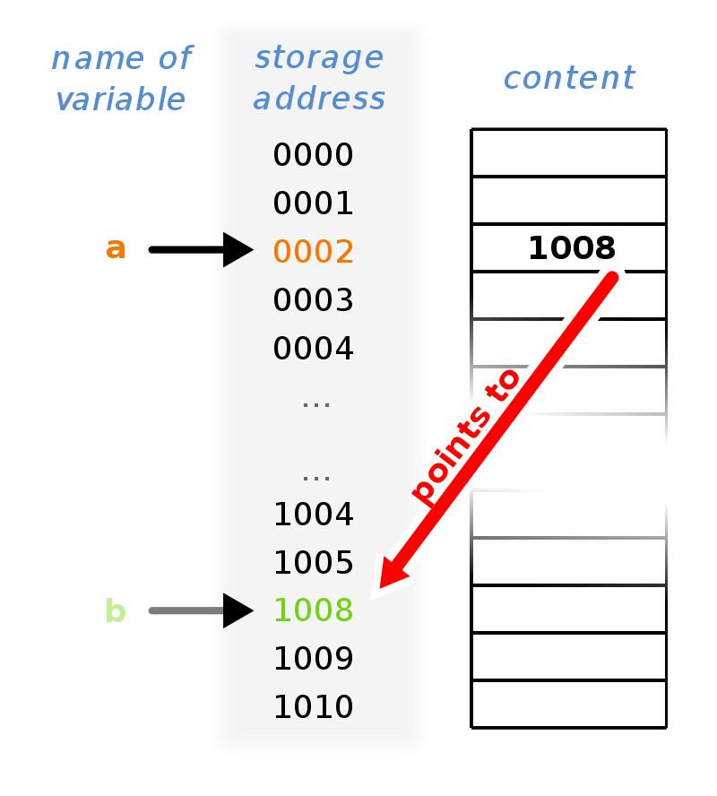

## 安裝 multipass

* [multipass](https://multipass.run/?_ga=2.30218559.1492289971.1615984144-554578233.1615984144)
* 不行就用其他linux

## 安裝 ubuntu

* [ubuntu](https://www.kjnotes.com/linux/29)

## Linux 用戶和用戶組管理

* [Linux 用戶和用戶組管理](https://www.runoob.com/linux/linux-user-manage.html)

## Multipass虛擬機

* [Multipass虛擬機](https://codingnote.cc/zh-tw/p/287792/)

## 虛擬機、模擬器的區別

    虛擬機:有模擬整套CPU的指令集
    模擬器:模擬電腦外部的行為

##  執行堆疊機 

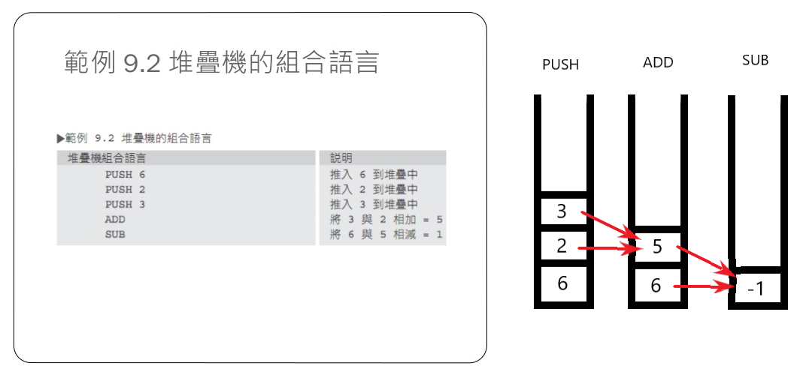

## gcc編譯流程
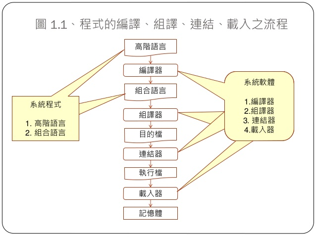
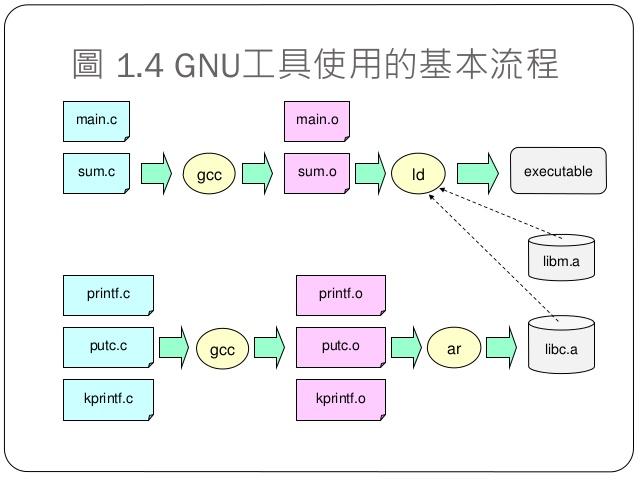
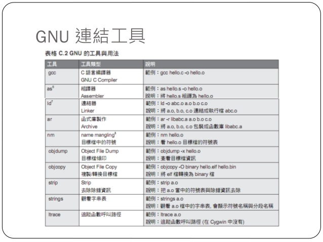

## 題外話 : 權利區分

    著作權(版權):作者終生+50年,須具有獨創性
    專利:20年,須具有首創性(新穎、進步、可實行)
    商標:10年(可續展),須具有識別性

## 記憶體配置
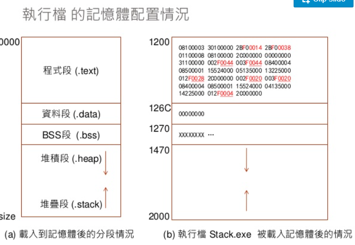

## 作業系統
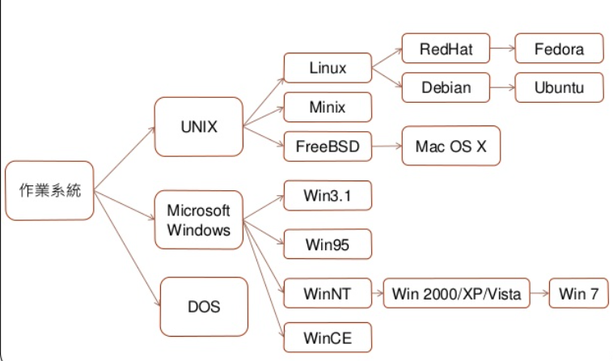

## Process
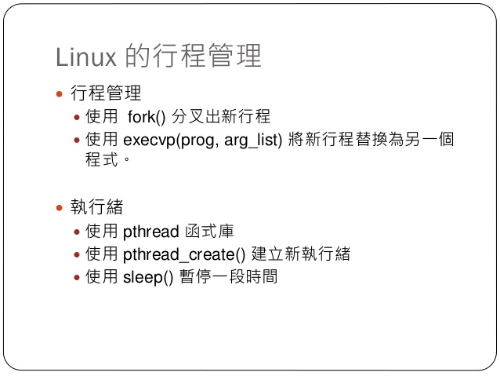
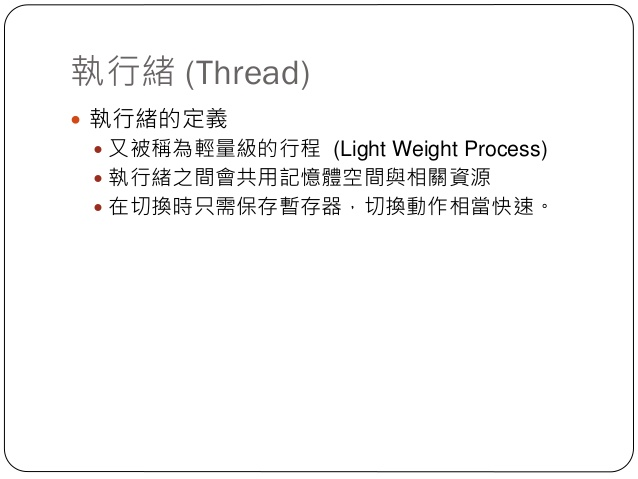
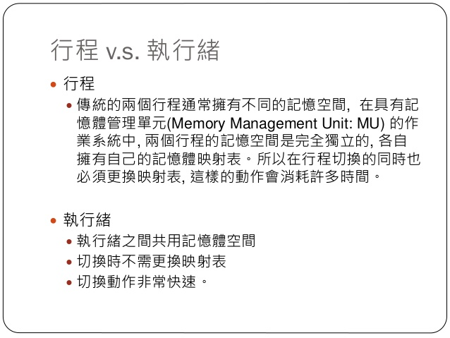

## 死結 deadlock

* 兩個以上的運算單元，雙方都在等待對方停止執行，以取得系統資源，但是沒有一方提前退出時，就稱為死結。

* P1、P2兩個process都需要資源才能繼續執行。P1擁有資源R2、還需要額外資源R1才能執行；P2擁有資源R1、還需要額外資源R2才能執行，兩邊都在互相等待而沒有任何一個可執行。
##
	#include <pthread.h>
	#include <stdio.h>
	#include <unistd.h>

	pthread_mutex_t x;
	pthread_mutex_t y;

	void *A(); 
	void *B(); 

	int main(int argc, char *argv[])
	{
   	 pthread_t threadA, threadB;
   	 pthread_attr_t attr;

   	 pthread_attr_init(&attr);
   	 pthread_mutex_init(&x, NULL);
   	 pthread_mutex_init(&y, NULL);

   	 pthread_create(&threadA, &attr, A, NULL);
   	 pthread_create(&threadB, &attr, B, NULL);
		
   	 pthread_join(threadA, NULL);
   	 pthread_join(threadB, NULL);

   	 pthread_mutex_destroy(&x);
   	 pthread_mutex_destroy(&y);
	}

	void *A() 
	{
   	 pthread_mutex_lock(&x);
  	  printf("A lock x\n");
	
   	 sleep(1);
   	 pthread_mutex_lock(&y);
   	 printf("A lock y\n");

   	 pthread_mutex_unlock(&y); 
  	  pthread_mutex_unlock(&x); 

   	 printf("finished A\n");

   	 pthread_exit(0);
	}

	void *B()
	{
    
   	 pthread_mutex_lock(&y);
  	  printf("B lock y\n");
   	 sleep(1);
  	  pthread_mutex_lock(&x);
  	  printf("B lock x\n");
  	  pthread_mutex_unlock(&x);
   	 pthread_mutex_unlock(&y);

   	 pthread_exit(0);
	}
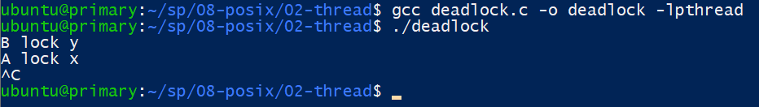

## race.c
	#include <stdio.h>
	#include <pthread.h>

	#define LOOPS 100000000
	int counter = 0;

	void *inc()
	{
 	 for (int i=0; i<LOOPS; i++) {
    counter = counter + 1;
  	}
 	 return NULL;
	}

	void *dec()
	{
  	for (int i=0; i<LOOPS; i++) {
   	 counter = counter - 1;
  	}
 	 return NULL;
	}

	int main() 
	{
  	pthread_t thread1, thread2;

 	 pthread_create(&thread1, NULL, inc, NULL);
 	 pthread_create(&thread2, NULL, dec, NULL);

 	 pthread_join( thread1, NULL);
  	pthread_join( thread2, NULL);
  	printf("counter=%d\n", counter);
	}
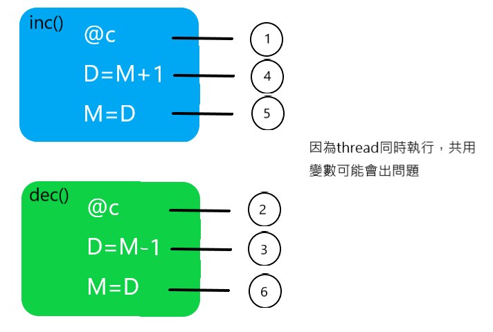
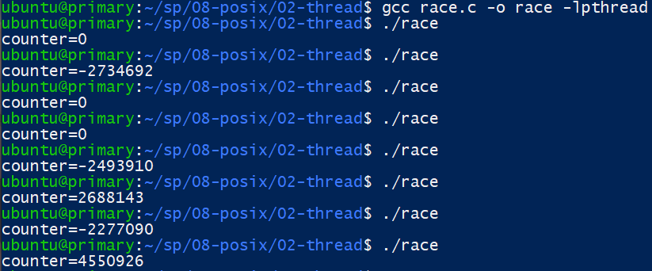
## norace.c
	#include <stdio.h>
	#include <pthread.h>

	pthread_mutex_t mutex1 = PTHREAD_MUTEX_INITIALIZER;
	#define LOOPS 100000
	int counter = 0;

	void *inc()
	{
 	 for (int i=0; i<LOOPS; i++) {
 	   pthread_mutex_lock( &mutex1 );
 	   counter = counter + 1;
 	   pthread_mutex_unlock( &mutex1 );
 	 }
	  return NULL;
	}

	void *dec()
	{
  	for (int i=0; i<LOOPS; i++) {
  	  pthread_mutex_lock( &mutex1 );
 	   counter = counter - 1;
 	   pthread_mutex_unlock( &mutex1 );
 	 }
	  return NULL;
	}

	int main() 
	{
		pthread_t thread1, thread2;
	
		pthread_create(&thread1, NULL, inc, NULL);
 	 pthread_create(&thread2, NULL, dec, NULL);

 	 pthread_join( thread1, NULL);
 	 pthread_join( thread2, NULL);
 	 printf("counter=%d\n", counter);
	}
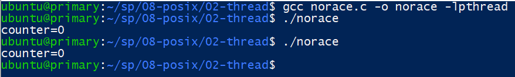
## 實體位址

* [實體位址](https://zh.wikipedia.org/wiki/%E7%89%A9%E7%90%86%E5%9C%B0%E5%9D%80)

## 邏輯位址

* [邏輯位址](https://zh.wikipedia.org/wiki/%E9%80%BB%E8%BE%91%E5%9C%B0%E5%9D%80)

## 哲學家問題
	#include <stdio.h>
	#include <unistd.h>
	#include <pthread.h>
	#include <semaphore.h>
	typedef	enum { False=0, True=1 } bool ;

	#define N 5
	#define P 3

	sem_t Room;
	sem_t Fork[P];
	bool Switch ;

	void *tphilosopher(void *ptr) {
		int i, k = *((int *) ptr);
		for(i = 1; i <= N; i++) {
			printf("%*cThink %d %d\n", k*4, ' ', k, i);
			if(Switch) {
				sem_wait(&Room) ;
			}
			sem_wait(&Fork[k]) ;
			sem_wait(&Fork[(k+1) % P]) ;
			printf("%*cEat %d %d\n", k*4, ' ', k, i);
			sem_post(&Fork[k]) ;
			sem_post(&Fork[(k+1) % P]) ;
			if(Switch) {
				sem_post(&Room) ;
				sleep(1);
			}
		}
		pthread_exit(0);
	}

	int main(int argc, char * argv[]) {
		int i, targ[P];
		pthread_t thread[P];
		sem_init(&Room, 0, P-1); 
		Switch = (argc > 1);
		printf("Switch=%s\n",(Switch?"true":"false"));
		for(i=0;i<P;i++) {
			sem_init(&Fork[i], 0, 1);
		}
		for(i=0;i<P;i++) {
			targ[i] = i;
			pthread_create(&thread[i], NULL, &tphilosopher,(void *) &targ[i]);
		}
		for(i=0;i<P;i++) {
			pthread_join(thread[i], NULL);
		}
		for(i=0;i<P;i++) {
			sem_destroy(&Fork[i]);
		}
		sem_destroy(&Room);
		return 0;
	}
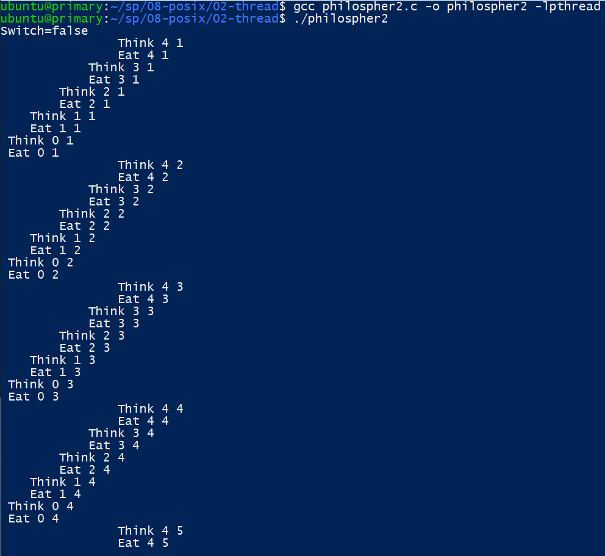